# volttron-kafka

1. [kafka Agent](https://github.com/VOLTTRON/volttron/tree/develop/services/contrib/KafkaAgent) 
   - [VOLTTRON/volttron:develop](https://github.com/VOLTTRON/volttron/tree/develop/services/contrib/KafkaAgent) 
   - [volttron/issues/1525](https://github.com/VOLTTRON/volttron/issues/1525) 
   - [volttron/pull/1563](https://github.com/VOLTTRON/volttron/pull/1563)
2. Cloud Agent


## 1. Kafak Agent

### Test environment & Prerequisites

- Ubuntu 16.04 LTS
- Apache Kafka 0.11.0.1
- kafka-python 1.3.5

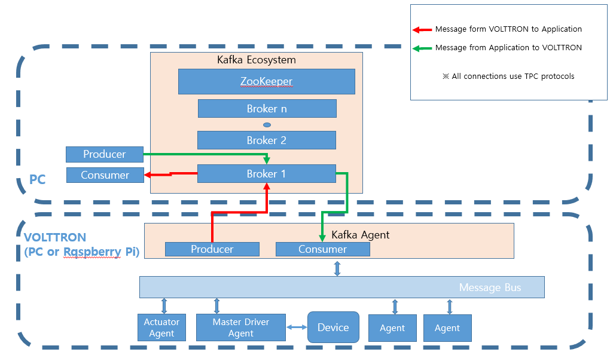


### Features

- VOLTTRON의 MessageBus로부터 데이터 수집 -> 수집한 데이터를 KafkaAgent의 producer를 통해 kafka broker로 전달 -> consumer는 broker로부터 메시지를 받음
- 볼트론 외부에서 메시지 생성 -> 생성한 메시지를 producer를 통해 kafka broker로 전달 -> VOLTTRON KafkaAgent의 consumer는 broker로부터 메시지를 받음 -> 받은 메시지를 VOLTTRON 내부의 MessageBus에 publish

### 

## How To install & run

#### Start Kafka zookeeper - PC

<https://www.apache.org/dyn/closer.cgi?path=/kafka/0.11.0.1/kafka_2.11-0.11.0.1.tgz> 에서 kafka 패키지 다운로드

```
tar -xzf kafka_2.11-0.11.0.1.tgz
cd kafka_2.11-0.11.0.1
bin/zookeeper-server-start.sh config/zookeeper.properties
```

#### Start Kafka server - PC

```
vi config/server.properties
```

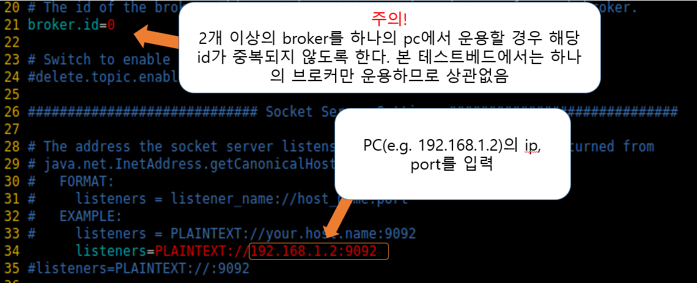

```
bin/kafka-server-start.sh config/server.properties
sudo ufw allow 9092
```


#### Install KafkaAgent

path: volttron/service/contrib/KafkaAgent

config 파일 수정 후 설치

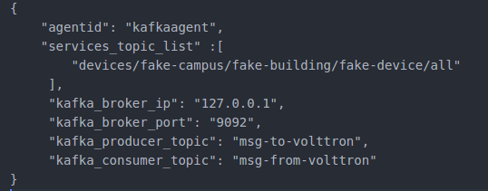


```
cd volttron
./scripts/core/pack_install.sh service/contrib/KafkaAgent service/contrib/KafkaAgent/config kafkaagent
vctl start <tag or identity of kafkaagent>
```


#### Start KakfaAgent - PC or Raspberry pi

producer로 메시지 전송

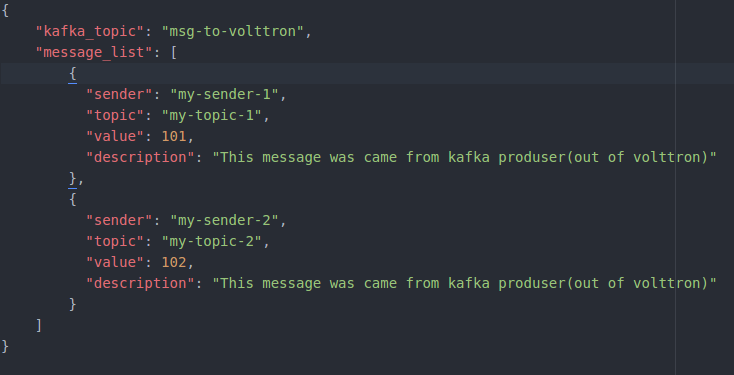


```
cd service/contrib/KafkaAgent
python Test/kafka_producer.py
```

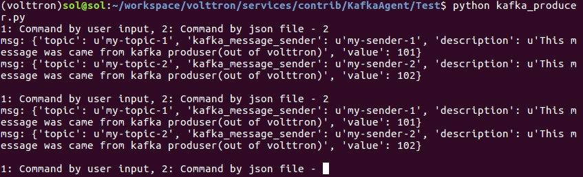

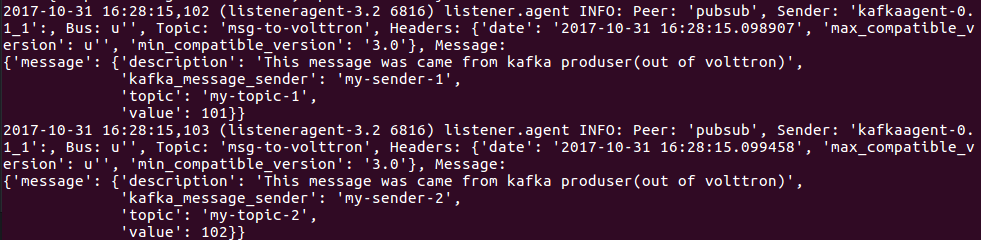


```
python Test/kafka_consumer.py
```

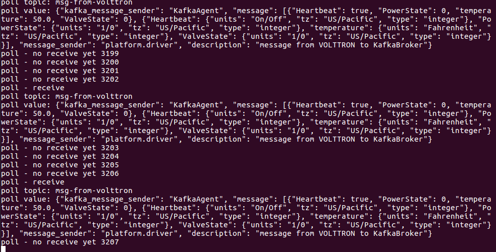


### ISSUE

#### KafkaAgent의 비동기 수신

현재 1초마다 kafkaagent의 특정 함수를 실행하여 메시지를 받음.

gevent등을 이용하면 좋을 듯

#### json error issue

자꾸 제이슨 에러가 뜨는데 에이전트 및 테스트 코드는 잘 돌아감. kafka-python에 issue로 물어봤는데 VOLTTRN내부의 로깅 시스템 문제일 수도 있다고 함. 링크. 확인 필요

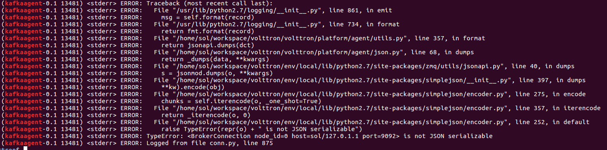

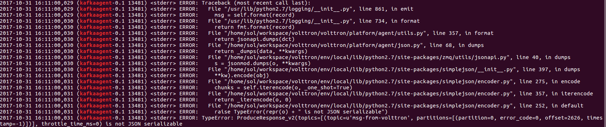

#### 기타 메시지 전송 형식 규정

어떠한 형식으로 보내는게 가장 좋을 지?


## 2. Cloud Agent

### Test environment & prerequisites
* Ubuntu 16.04 LTS
* Ubuntu 16.04 mate
* mongodb 3.4.4
* pymongo 3.4.0
* Mongobooster
* kafka 0.11.0.1

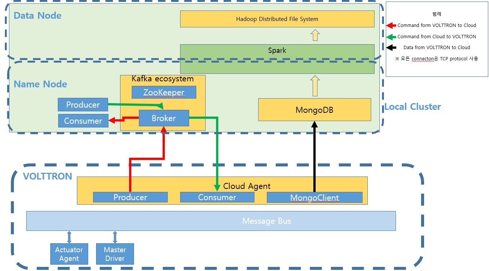

### TestBed with Raspberry Pi

#### Mongodb 설치 및 운용(MongoDB version : 3.4.4)

##### 설치 <https://docs.mongodb.com/manual/tutorial/install-mongodb-on-ubuntu/>

public key 등록
```
sudo apt-key adv --keyserver hkp://keyserver.ubuntu.com:80 --recv 0C49F3730359A14518585931BC711F9BA15703C6
```

몽고디비 리스트 생성(우분투 16.04 기준)
```
echo "deb [ arch=amd64,arm64 ] http://repo.mongodb.org/apt/ubuntu xenial/mongodb-org/3.4 multiverse" | sudo tee /etc/apt/sources.list.d/mongodb-org-3.4.list
```

로컬 패키지 업데이트
```
sudo apt-get update
```

MongoDB 패키지 설치
```
sudo apt-get install -y mongodb-org
```

##### 가동

192.168.99.* 서브넷에서 볼트론이 설치된 PC와 mongodb가 설치된 pc의 ip가 다르므로 볼트론이 설치된 PC에서 mongodb가 설치된 PC로 데이터가 와야합니다. 이때 mongodb가 설치된 PC로 데이터를 받기 위해 mongodb 설정 파일을 바꿉니다.

MongoDB 설치 후 /etc/mongod.conf 경로에 있는 mongodb 설정 파일을 변경합니다.
```
sudo vi etc/mongod.conf
```

아래 그림과 같이 net: 의 bindIP 부분에 MongoDB가 설치된 PC의 서브넷 ip를 입력합니다.

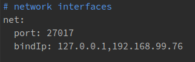

Mongodb 설정 파일 내용을 변경한 뒤 반드시 mongodb를 재시작 해주어야 변경 내용이 적용됩니다. 재시작 명령어는 아래와 같습니다. (시작, 중지 명령어도 밑에 추가합니다.)

```
# 재시작
sudo service mongod restart

# 시작
sudo service mongod start

# 중지
sudo service mongod stop 
```

추가내용 : mongodb 의 사용 port를 다르게 할 경우
sudo vi /etc/mongod.conf 명령어를 실행하여 아래 그림과 같이 net: 의 port 부분내용을 수정합니다. 여기서는 27018 이라고 하였습니다.

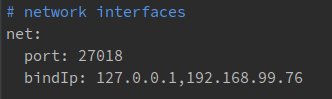

sudo service mongod restart 명령어로 MongoDB를 재시작 합니다.

mongo --port 27018 명령어로 mongodb 에 접속합니다.


##### 결론

아래 그림과 같이 나오면 MongoDB가 설치되었고 제대로 운용됨을 알 수 있습니다.

시스템을 재부팅 하는 경우 MongoDB가 운용되지 않을 수 있습니다. 따라서 MongoDB를 실행시켜 아래 그림과 같이 나오지 않을 시 sudo service mongod restart 혹은 start 명령어를 수행한 뒤 mongo 명령어를 수행하여 MongoDB가 제대로 운용되는지 확인해야 합니다.

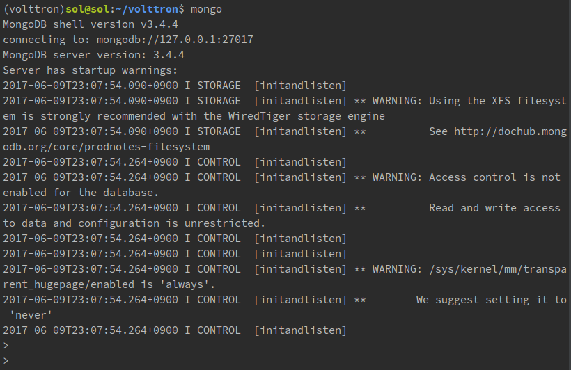

아래 그림과 같이 나오면 MongoDB가 실행중인 상태가 아니므로 CloudAgent설치 시 에러가 발생합니다

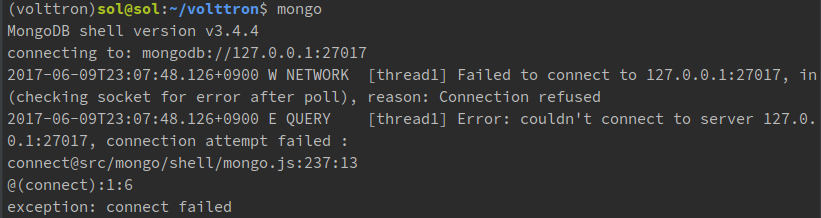

#### pymongo 설치

CloudAgent에서 MongoDB와 커넥션을 맺기 위해 파이썬 라이브러리인 pymongo를 사용합니다. 따라서 볼트론 파이썬 가상환경에서 아래의 명령어를 수행하여 pymongo를 설치합니다.

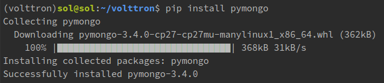

#### mongodb gui 설치 및 운용

오픈소스 Mongobooster 를 사용하였습니다.

##### Mongobooster설치

Mongobooster 공식 홈페이지에서 Linux 전용 파일 다운로드 <https://mongobooster.com/downloads>

다운로드 파일이 위치한 디렉토리에서 아래 명령어를 수행
```
# 실행 권한 부여
sudo chmod a+x mongobooster*.AppImage

# 파일 실행
./mongobooster*.AppImage
```

##### Mongobooster 

연결

외부의 PC(볼트론이 설치된 PC가 아닌 제 3의 PC) 에서 MongoDB가 설치된 PC로 접근할 경우 ( 같은 서브넷 내에서) 서버를 아이피:27017 로 설정

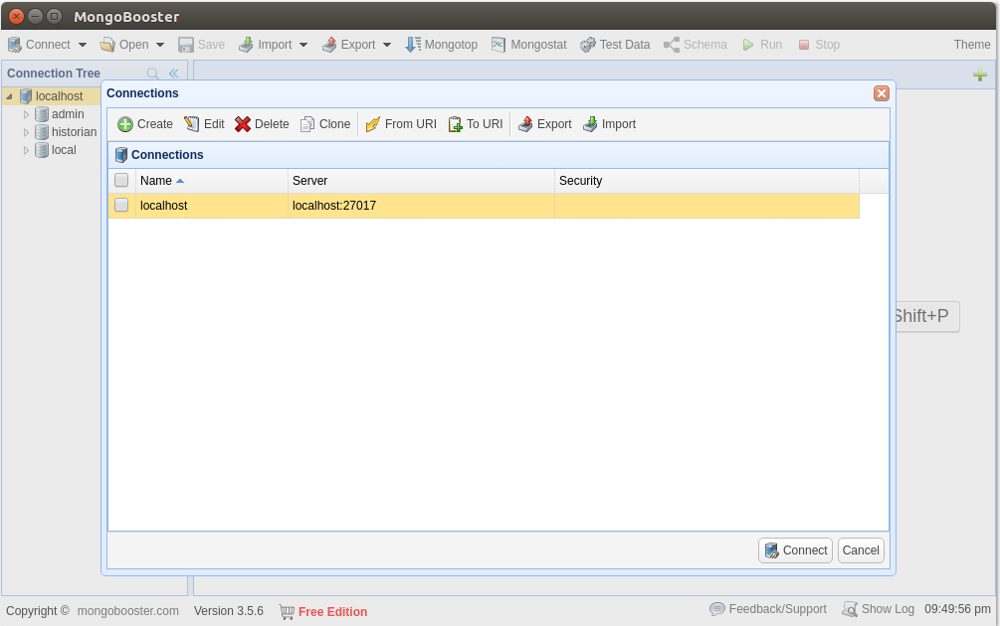

연결할 DB를 설정. Local 에 있을 경우 설정할 필요 없음.

쿼리 수행

데이터 일괄 조회 
'''
<database>.<collection>.find({})
'''

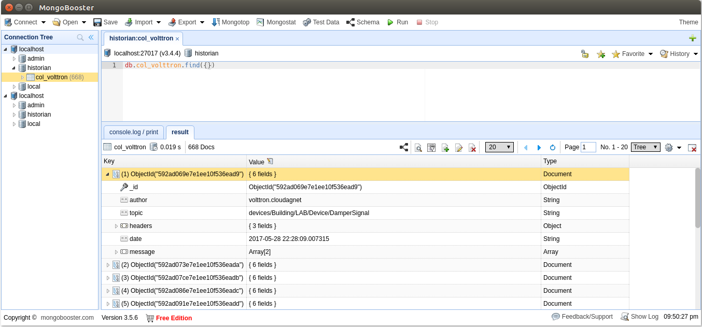

외부의 PC(볼트론이 설치된 PC가 아닌 제 3의 PC)에서 접근 후 쿼리 실행
```
<database>.<collection>.where(“topic”).eq(“devices/*”)
```

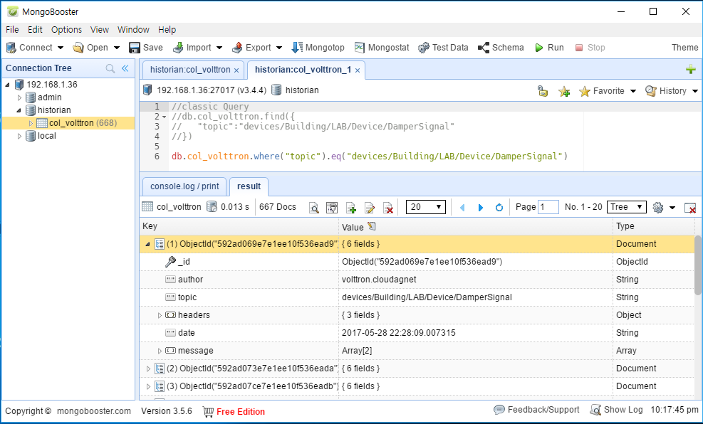

데이터 조회, 데이터의 key중 하나인 date가 최신인 순서대로 조회
```
<database>.<collection>.find({}).sort({date:-1})
```

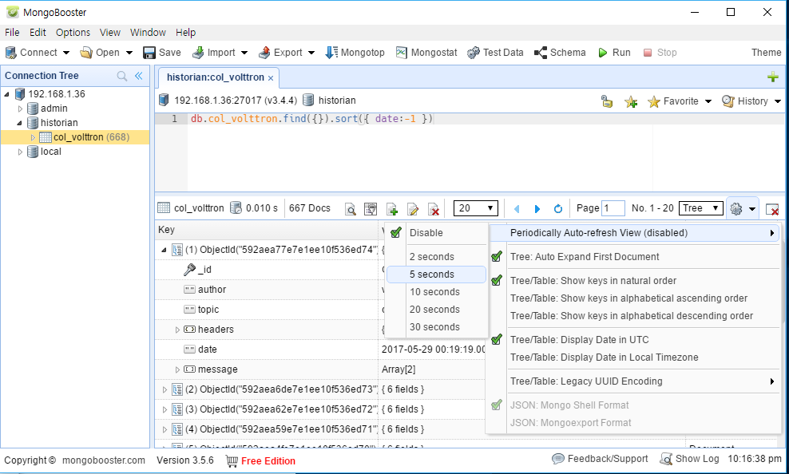


데이터 조회, 특정 topic 에 대해 조회

정규식을 통해서 devices/Building/LAB/Device 아래에 있는 topic 을 찾고 date 에 관하여 내림차순으로 정렬.
```
<database>.<collection>.find({topic:{$regex: “devices/Building/LAB/Device/”}).sort({date:-1})
```

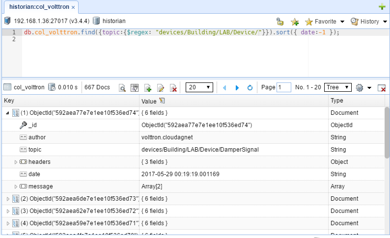

VOLTTRON에서 Cloud로의 Command 내역 조회
```
<database>.<collection>.find({“topic”: “command-to-cloud”})
```

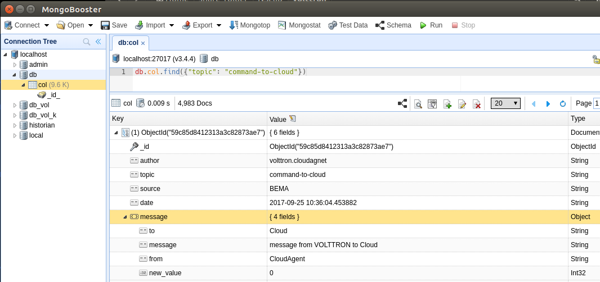

Cloud에서 VOLTTRON으로의 Command 내역 조회
```
<database>.<collection>.find({“topic”: “command-from-cloud”})
```

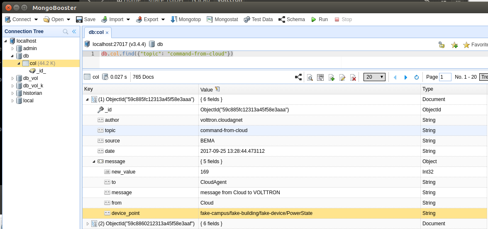


#### Kafka zookeeper 실행 - PC

<https://www.apache.org/dyn/closer.cgi?path=/kafka/0.11.0.1/kafka_2.11-0.11.0.1.tgz> 에서 kafka 패키지 다운로드
```
tar -xzf kafka_2.11-0.11.0.1.tgz
cd kafka_2.11-0.11.0.1
bin/zookeeper-server-start.sh config/zookeeper.properties
```

#### Kafka server 실행 - PC

```
vi config/server.properties
```


```
bin/kafka-server-start.sh config/server.properties
sudo ufw allow 9092
```

#### CloudAgent 설치 - Raspberry Pi

위치 : ~/workspace/volttron/example/CloudAgent

config 파일 수정 후 설치

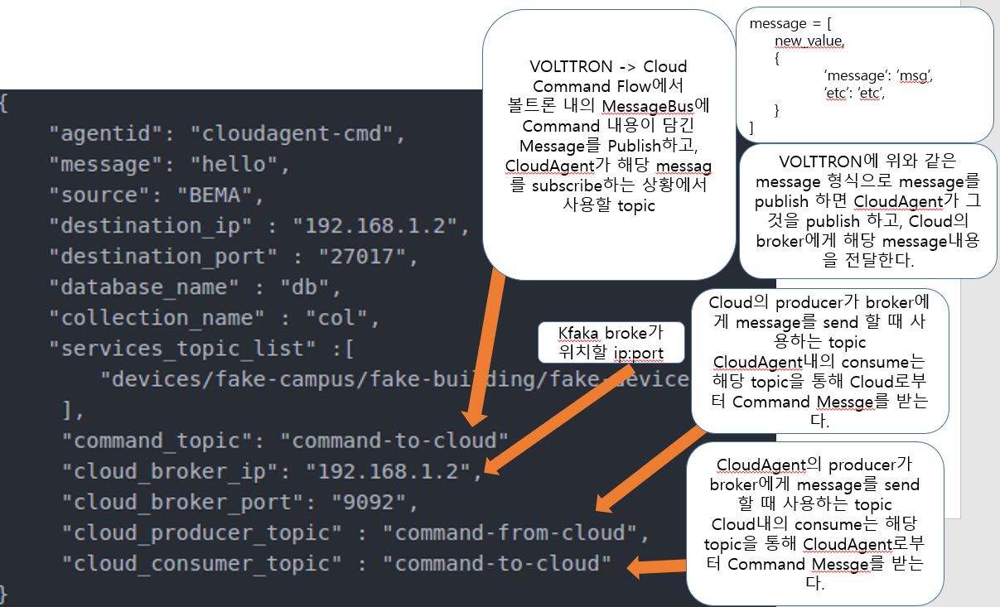

#### Cloud 측 consumer 실행 - PC
kafa-python package 설치
```
pip install kafka-python
```

위치: Test/
cloud_producer.py: VOLTTRON의 의 CloudAgent로 Message 송신
cloud_consumer.py: VOLTTRON의 CloudAgent로부터 Message 수신

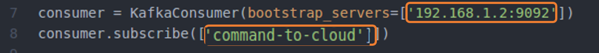

```
python cloud_consumer.py
```

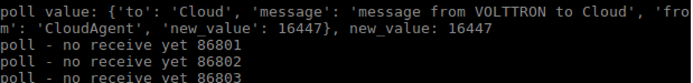

#### Cloud 측 producer 실행 – PC
위치: Test/
cloud_producer.py: VOLTTRON의 의 CloudAgent로 Message 송신
broker ip:port 주소 입력

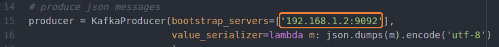

```
python cloud_producer.py
```
user input으로 command를 보내는 경우

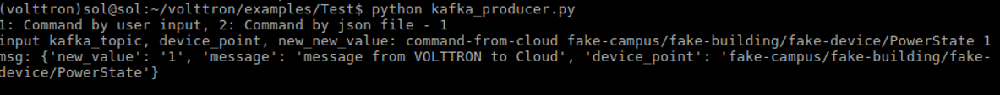

```
python cloud_producer.py
```

json file을 통해 복수의 device point에 comman를 보내는 경우

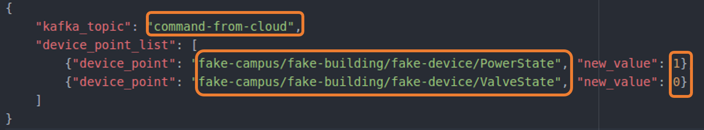

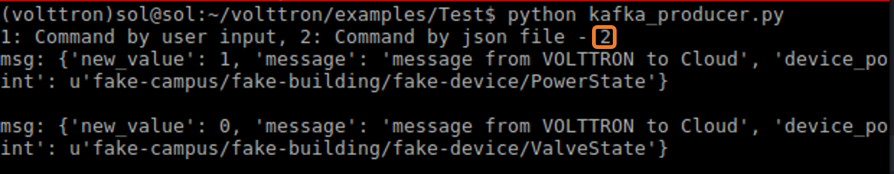

#### VoLTTRON Central(Web UI) 에서 그래프로 device point 값 변경 여부 확인 - Raspberry Pi

localhost:8080 or <Rasberry Pi IP>:8080 접속

id, pw : volttron, 1234

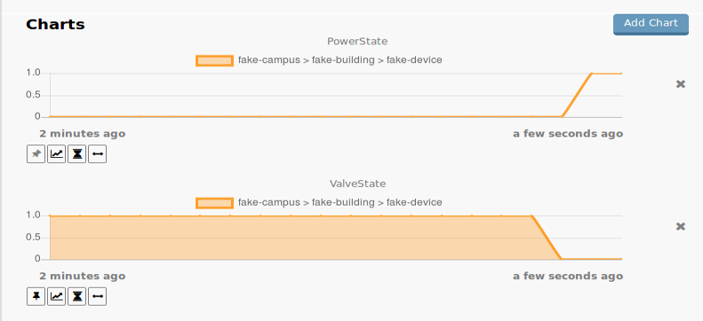

#### Mongobooster 로 command & device data 확인 – PC


