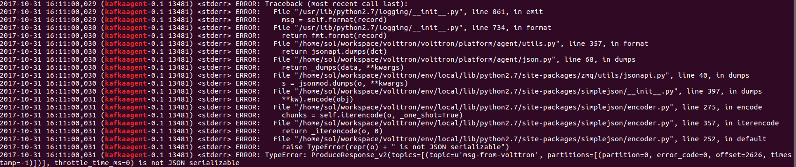

### Test environment & Prerequisites

* Ubuntu 16.04 LTS
* Apache Kafka 0.11.0.1
* kafka-python 1.3.5


### Features

* VOLTTRON의 MessageBus로부터 데이터 수집 -> 수집한 데이터를 KafkaAgent의 producer를 통해 kafka broker로 전달 -> consumer는 broker로부터 메시지를 받음
* 볼트론 외부에서 메시지 생성 -> 생성한 메시지를 producer를 통해 kafka broker로 전달 -> VOLTTRON KafkaAgent의 consumer는 broker로부터 메시지를 받음 -> 받은 메시지를 VOLTTRON 내부의 MessageBus에 publish

### 

## How To install & run

#### Start Kafka zookeeper - PC

<https://www.apache.org/dyn/closer.cgi?path=/kafka/0.11.0.1/kafka_2.11-0.11.0.1.tgz> 에서 kafka 패키지 다운로드
```
tar -xzf kafka_2.11-0.11.0.1.tgz
cd kafka_2.11-0.11.0.1
bin/zookeeper-server-start.sh config/zookeeper.properties
```

#### Start Kafka server - PC

```
vi config/server.properties
```


```
bin/kafka-server-start.sh config/server.properties
sudo ufw allow 9092
```


#### Install KafkaAgent

path: volttron/service/contrib/KafkaAgent

config 파일 수정 후 설치


```
cd volttron
./scripts/core/pack_install.sh service/contrib/KafkaAgent service/contrib/KafkaAgent/config kafkaagent
vctl start <tag or identity of kafkaagent>
```


#### Start KakfaAgent - PC or Raspberry pi

producer로 메시지 전송


```
cd service/contrib/KafkaAgent
python Test/kafka_producer.py
```


```
python Test/kafka_consumer.py
```


### ISSUE 

#### KafkaAgent의 비동기 수신

현재 1초마다 kafkaagent의 특정 함수를 실행하여 메시지를 받음.

gevent등을 이용하면 좋을 듯

#### json error issue

자꾸 제이슨 에러가 뜨는데 에이전트 및 테스트 코드는 잘 돌아감. kafka-python에 issue로 물어봤는데 VOLTTRN내부의 로깅 시스템 문제일 수도 있다고 함. 링크. 확인 필요




#### 기타 메시지 전송 형식 규정

어떠한 형식으로 보내는게 가장 좋을 지?